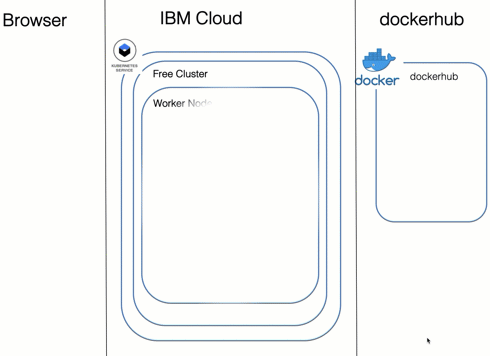

# How to setup a simple Mongo DB server and Mongo UI container in Hackathon on a free IBM Cloud Kubernetes cluster

## Objective

The object is to provide a small guide, how to setup a Mongo DB server and Mongo UI on a free IBM Cloud Kubernetes cluster. 

>> No `persistent volume claims` are used. So, keep in mind, if your Pod in Kubernetes crashes the data of the Database is lost.

Based on the securies feature of the mongo port `27017`, you need to run the application in the Kubernetes cluster to access the Mongo database.

In other words, your UI application has to access the database using a server application, which also run on the free Kubernetes cluster (like the Mongo UI in that example here). You should implement a [backend for frontend architecture](https://developer.ibm.com/technologies/microservices/patterns/create-backend-for-frontend-application-architecture/).

Checkout the video on YouTube:

[](https://www.youtube.com/watch?v=JXlplSSK1k4 "Click play on youtube")

## Overview

The gif shows what is automated deployed with the bash script and the yaml specification, and in addition, how the Mongo UI access the Mongo DB server from a browser.

* Automated deployment:

    1) We have two container images in dockerhub `mongo` and `mongo-express`
    2) We create a `Pod` for the Mongo server and pointing to the `mongo` image in dockerhub
    3) We create a [`Kubernetes service`](https://kubernetes.io/docs/concepts/services-networking/service/) for the `mongo-db` Pod to use the DNS inside Kubernetes
    4) We create a Pod for the Mongo UI and pointing to the `mongo-express` image in dockerhub.
    5) We create a [`Kubernetes service`](https://kubernetes.io/docs/concepts/services-networking/service/) for the `mongo-ui` Pod to use the DNS inside Kubernetes and make the service available from outside using the `NodePort` of the current `WorkerNode`.

* Access the Mongo DB using the Mongo UI

    1) Open the browser and access the Mongo Express application with http://WorkerNodeIP:NodePort
    2) The `mongo-ui` Pod access the `mongo-db` server with the [`Kubernetes service`](https://kubernetes.io/docs/concepts/services-networking/service/) name and Mongo credentials.

    In the following extract from the `mongo-express-docker.yaml` file, you see the settings for `mongo-express` application to access the Mongo DB service. 
    The value of the `ME_CONFIG_MONGODB_SERVER` is the [`Kubernetes service`](https://kubernetes.io/docs/concepts/services-networking/service/) name `mongo-database`.

    ```yaml
    env:
        - name: ME_CONFIG_MONGODB_SERVER 
          value: mongo-database
        - name: ME_CONFIG_MONGODB_ADMINUSERNAME
          value: mongoadmin
        - name: ME_CONFIG_MONGODB_ADMINPASSWORD
          value: secret
    ```



Used Docker images:

* Mongo DB: https://hub.docker.com/_/mongo    
* Mongo WEBUI: https://hub.docker.com/_/mongo-express

## Setup

### Stet 1: Clone the project

```sh
git clone https://github.com/thomassuedbroecker/mongodb-container-kubernetes.git
cd mongbo-container-kubernetes
```

### Step 2: Setup free IBM Cloud Kubernetes cluster

If you don't have a free IBM Cloud Kubernetes cluster, follow the steps in the Cloud Native Starter workshop to setup your free IBM Cloud Kubernetes cluster.

* [Create free IBM Cloud Kubernetes cluster](https://github.com/IBM/cloud-native-starter/blob/master/workshop-one-service/0-create-kubernetes-cluster.md)

### Step 3: Access to your free Kubernetes Cluster in your terminal session

Follow the steps in the Access tab, by starting from After your cluster provision, gain Access and insert the commands into your terminal session.

* [Verify the access to Kubernetes](https://github.com/IBM/cloud-native-starter/blob/master/workshop-one-service/1-prereqs.md#verify-access-to-kubernetes-on-the-ibm-cloud)

### Step 4: Understand the `setup-mongo-db-and-ui.sh` script

Here are the relevant varibales in the bash script:

```bash
#!/bin/bash
CLUSTER_NAME=cloud-native
NAMESPACE=mongo-db
SERVICE_NAME_DATABASE=mongo-database
SERVICE_NAME_EXPRESS=mongo-express
```

### Step 5: Execute the script `setup-mongo-db-and-ui.sh`

The script creates a namespace `mongo-db` and shows at the end links to both applications running on Kubernetes. 

```sh
sh setup-mongo-db-and-ui.sh
```

### Step 6: Open a new browser tab and insert the first link from the script output to access the Mongo database.


### Step 7: Open a browser and insert the second link from the script to access the Mongo UI with Mongo Express application.


## Additional resources

* Ports: https://docs.mongodb.com/manual/mongo/
* Used Docker images from dockerhub:
    * DB: https://hub.docker.com/_/mongo    
    * WEBUI: https://hub.docker.com/_/mongo-express
    * PORTS: https://docs.mongodb.com/manual/reference/default-mongodb-port/
* Understand the concept of deployments to the IBM Cloud free Kubernetes, using the Microservice example in the workshop of the Cloud Native Starter project your find [here](https://github.com/IBM/cloud-native-starter/tree/master/workshop) and inspect lab 4.
